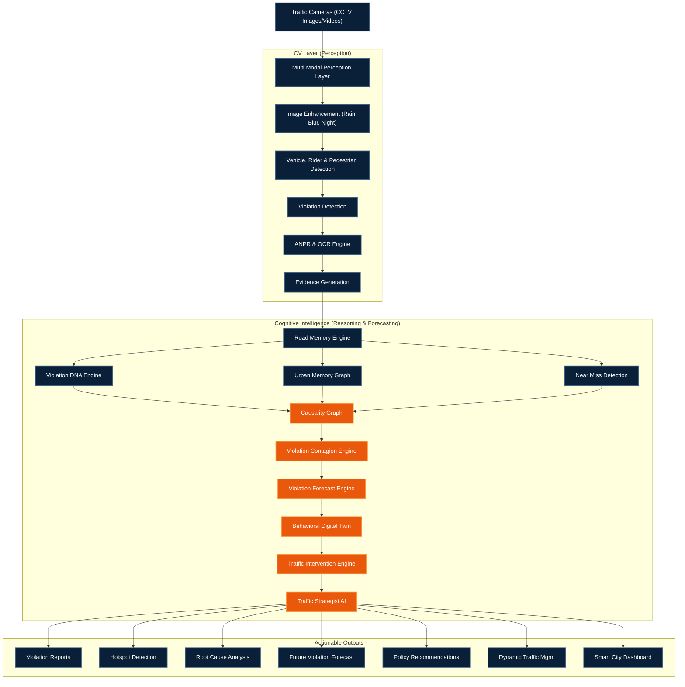

# 🛣️ RoadMind-X
**From Detection to Prevention: A Cognitive Traffic Intelligence Platform**

*RoadMind-X doesn't just detect traffic violations — it remembers them, understands their causes, predicts their spread, simulates solutions, and prevents them before they happen.*

---

## 🛑 The Problem: Reactive Enforcement

Traffic management systems today are entirely **reactive**: violation → camera capture → fine generation (days later).
- **No Pattern Recognition**: There is no long-term memory of why a road repeats the same violations daily.
- **No Root-Cause Analysis**: Systems enforce blindly without understanding the underlying urban triggers.
- **Zero Forecasting**: Existing ANPR tools cannot predict future hotspots or risks.
- **No Prevention**: Fines arrive days late, doing nothing to prevent accidents or ease congestion in real-time.

---

## 💡 The Solution: Cognitive Intelligence

**RoadMind-X** transforms traditional CCTV feeds by adding a high-level **Memory, Reasoning, and Forecasting Layer**. It logs road behavior over time, constructs a causal graph to find the root causes of violation spikes, forecasts risk 24–72 hours into the future, and simulates interventions using a digital twin.

We shift the entire smart-city workflow from **"Detect & Fine"** to **"Understand & Prevent"**.

---

## 🏗️ System Architecture

Our end-to-end pipeline operates in three distinct phases: the **Perception Layer**, the **Cognitive Intelligence Engine**, and the **Actionable Outputs**.

---

## 🧠 Core AI Engines Explained

### 1. Road Memory & Violation DNA Engine
Every road builds a living memory (using **TimescaleDB**). The DNA Engine profiles roads based on recurring offenses (e.g., *Market Zones* → Parking Violations; *Highway Zones* → Speeding). 

### 2. Urban Memory & Causality Graph
Powered by **Neo4j**, the Urban Memory Graph links roads to external urban events (festivals, hospital shifts, school timings). The Causality Graph explains **WHY** a violation occurs. 
*(e.g., Festival Event → Parking Overflow → Road Narrowing → Wrong-Side Driving).*

### 3. Violation Contagion & Forecast Engine
Violations spread like a contagion. If one lane blocks, congestion cascades, leading to signal jumping elsewhere. The **Temporal Fusion Transformer (TFT)** calculates spread risk scores and predicts violation hotspots **24–72 hours in advance**.

### 4. Behavioral Digital Twin & Strategist AI
A virtual replica of the city's traffic grid. It allows authorities to test "What-If" scenarios (e.g., *What if we add 20 parking slots here? What if we re-time this signal?*). The **Strategist AI** (powered by RAG and Qdrant) generates explainable, confidence-ranked recommendations for authorities.

---

## 🛠️ Technology Stack

| Domain | Technologies | Purpose |
|---|---|---|
| **Frontend** | React, Next.js, Mapbox GL JS | Real-time smart city command dashboard and GIS visualization. |
| **Backend** | FastAPI (Python), Async REST | High-throughput microservices architecture. |
| **CV / Edge AI** | YOLOv12, RT-DETR, PaddleOCR | Ultra-low latency (<30ms) perception and ANPR pipelines. |
| **Predictive AI** | TFT, GNNs, LLM Agents | Time-series forecasting and Causal Graph traversals. |
| **Databases** | TimescaleDB, Neo4j, Qdrant | Time-series memory, Graph relationships, and Vector logic. |
| **Storage** | AWS S3 / MinIO | Secure, timestamped evidence packaging. |

---

## 🗺️ Implementation Roadmap

A phased, zero-disruption rollout model designed for massive urban scale:

1. **Phase 1: Detection + OCR (Months 1-3)**
   - YOLOv12/RT-DETR deployment on existing CCTV networks.
   - PaddleOCR setup for flawless ANPR and Evidence Generation.
2. **Phase 2: Road Memory Engine (Months 4-6)**
   - TimescaleDB setup and memory schema design.
   - Initial ingestion of temporal patterns and DNA profiling.
3. **Phase 3: Graph Intelligence (Months 7-9)**
   - Neo4j deployment and Urban Memory Graph build.
   - Causality engine and Graph Neural Network (GNN) training.
4. **Phase 4: Forecast Engine (Months 10-12)**
   - Temporal Fusion Transformer (TFT) model deployment.
   - Risk score APIs, early-alert systems, and dashboard integration.
5. **Phase 5: Digital Twin + Strategist AI (Months 13-18)**
   - Simulation engine live for "What-If" policy testing.
   - Signal optimization automation and city-wide intelligent scaling.

---

## 📈 Expected Impact

- 🚀 **3x Faster** monitoring for traffic authorities.
- 📉 **40% Reduction** in recurring traffic violations and accidents.
- 🏙 **22% Decrease** in urban congestion.
- 🎯 **70% Drop** in repeat offenses via predictive enforcement rather than reactive punishment.

> **RoadMind-X transforms traffic enforcement into traffic intelligence. Building roads that learn, think, and prevent.**
