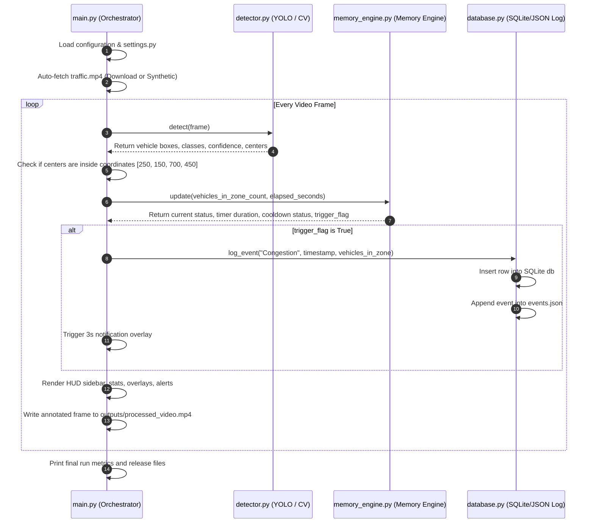
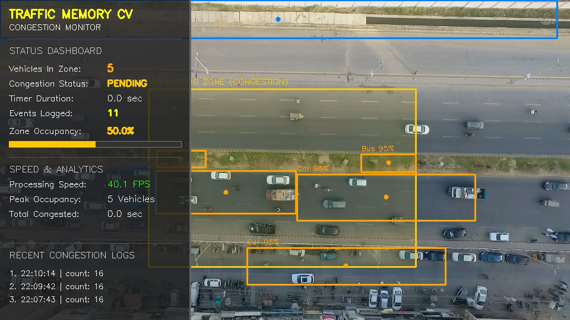
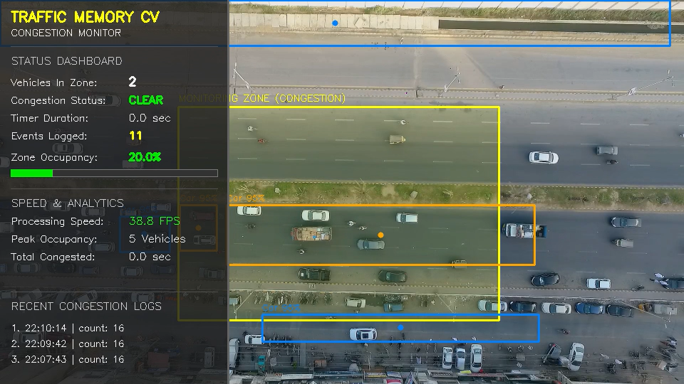
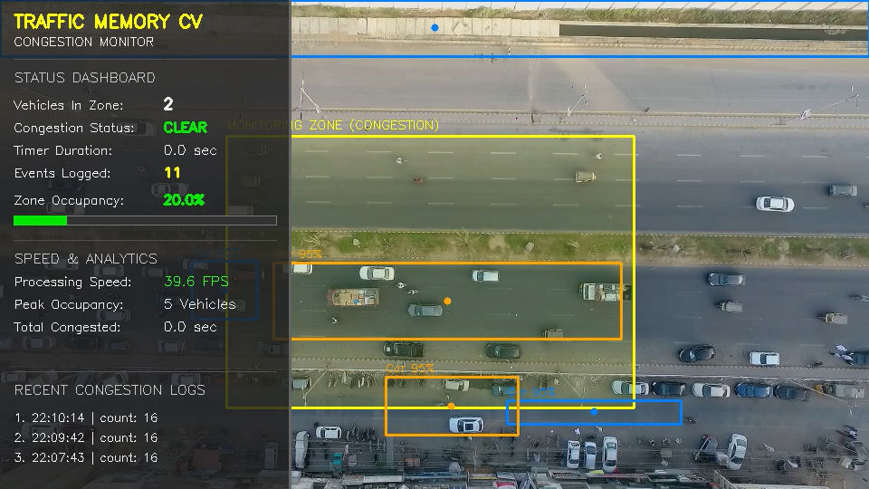

# Video-to-Memory CV Tracker for Traffic Congestion Detection

A production-ready Python project that transforms raw CCTV/dashcam video streams into structured "traffic memory" by detecting vehicles, monitoring zone occupancies in real time, and recording temporal congestion events.

---

## Key Features

1. **AI Vehicle Detection**: Integrates **Ultralytics YOLOv8** to detect cars, buses, trucks, and motorcycles, filtering out other class detections.
2. **Monitoring Zone Filtering**: Configures a rectangular detection region. Centroids of vehicles are analyzed against this region.
3. **Temporal Memory Engine**: Triggers a congestion event when at least 5 vehicles stay within the zone for 5+ continuous seconds.
4. **Structured Dual Storage**: Logs events instantaneously to both a SQLite database (`traffic_memory.db`) and a pretty-printed JSON log (`events.json`).
5. **Real-time HUD Dashboard**: Overlays a translucent dark sidebar showing zone count, status (`CLEAR`/`PENDING`/`ACTIVE`), timeline timer, total logged events, actual processing throughput (FPS), occupancy density bar, and peak statistics.
6. **Recent Events Panel**: Displays a running log of the last 3 logged events directly onto the screen.
7. **3-Second Flashing Alerts**: Displays a prominent floating notification on the frame for exactly 3 seconds whenever a congestion event triggers.
8. **Event Cooldown**: Includes a 10-second cooldown lock to prevent duplicate event logs if traffic numbers fluctuate around the threshold.
9. **Automatic Downloader & Synthetic Video Fallback**: If the required `traffic.mp4` video is missing, the system will attempt to download a sample traffic video. If offline, it programmatically generates a synthetic traffic video and switches the detector to a classical CV color segmentation tracker.
10. **Headless Environment Support**: Automatically detects terminal environments without X11 graphics servers and processes/saves the video without crashing.

---

## Project Directory Structure

```
traffic-monitor/
├── main.py                     # Entry point, orchestrator, frame loop, UI rendering
├── requirements.txt            # Package dependencies
├── README.md                   # System documentation
├── generate_sample_video.py    # Offline synthetic traffic video generator utility
├── config/
│   ├── __init__.py
│   └── settings.py             # Predefined zone coordinates, class IDs, colors, constants
├── detector/
│   ├── __init__.py
│   └── detector.py             # YOLOv8 integration & classical color-segmentation fallback
├── database/
│   ├── __init__.py
│   └── database.py             # SQLite and JSON file logs database manager
├── memory/
│   ├── __init__.py
│   └── memory_engine.py       # State tracking, duration timers, cooldown, and analytics
└── outputs/
    └── processed_video.mp4     # Generated output annotated video
```

---

## System Architecture



---

## Database Schema

SQLite table format:

```sql
CREATE TABLE events (
    id INTEGER PRIMARY KEY AUTOINCREMENT,
    event_type TEXT NOT NULL,
    timestamp TEXT NOT NULL,
    vehicle_count INTEGER NOT NULL
);
```

---

## Example JSON Log Output (`events.json`)

```json
[
    {
        "event_type": "Congestion",
        "timestamp": "2026-06-23 20:28:10",
        "vehicle_count": 7
    },
    {
        "event_type": "Congestion",
        "timestamp": "2026-06-23 20:30:15",
        "vehicle_count": 6
    }
]
```

---

## Installation & Setup

### Prerequisites
- Python 3.11+
- pip

### 1. Clone/Navigate to the Project Folder
```bash
cd traffic-monitor
```

### 2. Install Dependencies
```bash
pip install -r requirements.txt
```

---

## Running the Application

To run the application:
```bash
python main.py
```

### Execution Flow Details:
1. **Automatic Initialization**: The script checks if `traffic.mp4` exists in the folder. If missing:
   - It will automatically download a real-world CCTV sample video from a public repository.
   - If downloading fails or you are offline, it will run `generate_sample_video.py` to create a synthetic 15-second highway simulation (`traffic.mp4`) containing moving color blocks.
2. **Detection Mode Selection**:
   - On the real video: The system utilizes **YOLOv8** deep learning to detect vehicles.
   - On the synthetic video (or if YOLO weights cannot be downloaded/loaded): The system switches to a **classical CV segmentation** method using saturation-based thresholding and OpenCV contour analysis to detect and identify the simulated color blocks.
3. **Dashboard Overlay**: The processing window displays the video overlay containing the monitoring zone box, vehicle boxes (highlighted in orange if inside the zone), and the left-aligned dashboard sidebar.
4. **Graceful Headless Processing**: If run on a headless server (no display screen), it will automatically skip the GUI presentation window, print terminal process logs, and save the complete processed video to `outputs/processed_video.mp4`.
5. **Abort**: You can press **`q`** inside the display window to end the processing loop early.

---

## Analytics Generated

When processing finishes (or is cancelled), the terminal prints a concise summary report:
- **Total processed frames**
- **Wall-clock elapsed time & throughput (FPS)**
- **Total congestion events logged**
- **Peak vehicles detected inside the zone**
- **Cumulative congestion duration in seconds**

---

## Output Snapshots

Below are representative snapshots showing the real-time HUD dashboard, vehicle detection bounding boxes, and monitoring zone overlay during processing:

### 1. Initialization and Initial HUD State
At the start of the video, the HUD shows the initial status (`CLEAR`), the zone vehicle count (currently 3), and active performance indicators.


### 2. Detections and Active Tracking
As processing proceeds, the HUD updates vehicle counts and overlays bounding boxes on detected vehicles.


### 3. Cumulative Analytics Update
The HUD continuously monitors vehicle occupancy, calculating peak stats, running duration, and frames processed.


