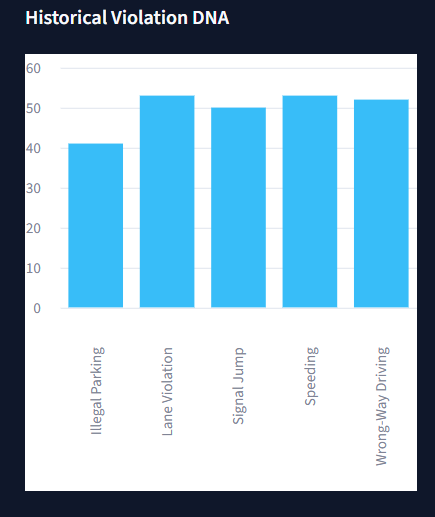
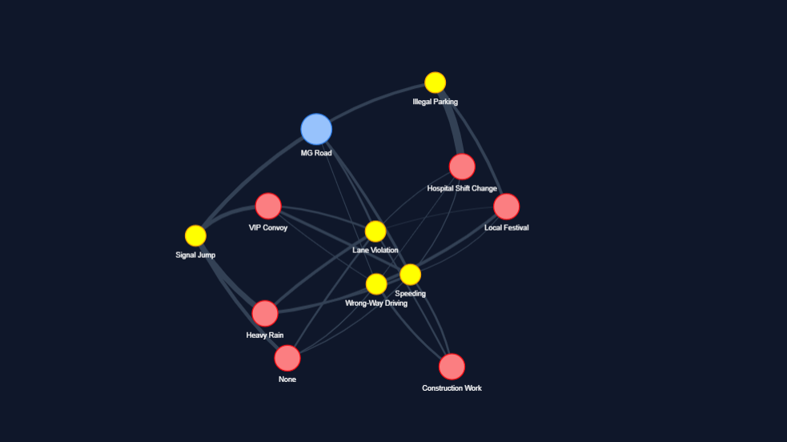
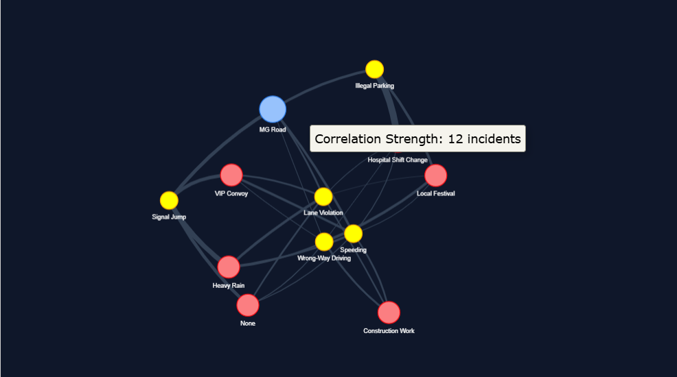
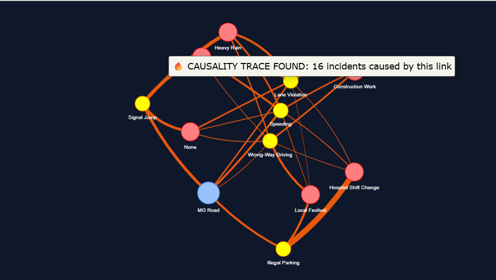

# Causality Graph Visualizer (Cognitive Intelligence Layer)

## 🌍 Global Context
This module represents the first half of the **Cognitive Intelligence Engine**. Once the CV Layer (P6) generates evidence, it passes it here. This module proves the core innovation of RoadMind-X: moving beyond simple detection by actually *reasoning* about the Root Cause of traffic patterns. 

For the hackathon demo, this will be a standalone web interface that visualizes the graph algorithms linking traffic spikes to urban events.

## 📐 Architecture Alignment (What you must demonstrate)
According to the `README.md` architecture diagram, you must demonstrate the flow from **RME** into the final **CG** node:
*   **RME:** Road Memory Engine (Ingests P6 data)
*   **DNA:** Violation DNA Engine (Profiles the road)
*   **UMG:** Urban Memory Graph (External context like Weather/Festivals)
*   **NMD:** Near Miss Detection
*   **CG:** Causality Graph (The final reasoning output)

## 🛠️ Step-by-Step Build Guide
**Tech Stack:** Python, Streamlit, NetworkX, and PyVis (for the interactive network graph).

1.  **The Data Source (RME input):** Use the `data/urban_memory_logs.json` file. 
2.  **Building the Graph Nodes (UMG & DNA):** 
    *   Create three types of nodes in your visualization based on the data: 
        *   🔵 **Location Nodes** (Represents the Road DNA profile)
        *   🔴 **Violation/NMD Nodes** (Represents the spike or near misses)
        *   🟡 **Context Nodes** (Represents the UMG, like Hospital Shift Change or Festival)
3.  **The Causality Demo (CG - The Hack):** 
    *   The graph should load as a beautiful, floating 2D or 3D network.
    *   Add a large button on the screen: `"Run Causality Graph (CG): MG Road"`.
    *   When clicked, the app should highlight a specific path through the network (e.g., The line connects `Hospital Shift Change` → `Parking Overflow` → `MG Road Violations`) and dim the rest of the graph.
4.  **Road DNA Panel:** 
    *   When the user clicks on a "Location Node", open a side panel showing the **Violation DNA Engine (DNA)** profile (e.g., "High Risk Time: 6 PM - 8 PM", "Primary Violation: Parking").

## ?? Output Snapshots

### 1. Road Memory DNA Chart

### 2. Urban Memory Graph (Base State)

### 3. Graph Correlation Hover

### 4. Causality Trace Engine

